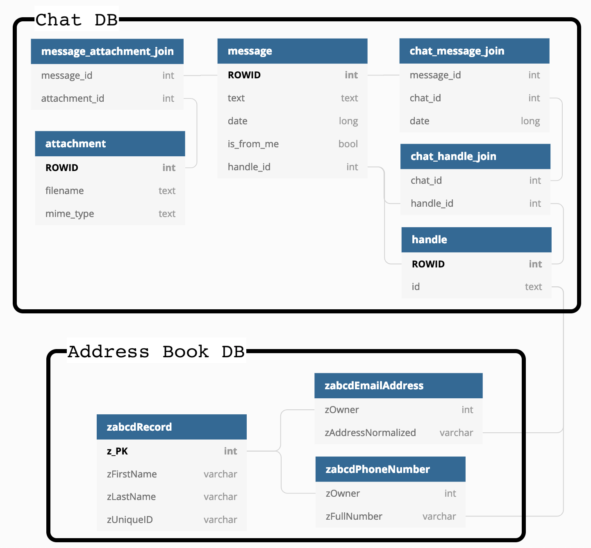

## Messages

All messages are stored in a single SQLite3 database located at `~/Library/Messages/chat.db`.
Accessing this file under Mojave requires "Full Disk Access" permissions.
For development builds, it's easiest to copy this file somewhere that you don't need permission (like `~/Desktop`).

The rows of the `message` table each represent a single message.
The only thing we really need for an individual message is the what, when, and who.
The "what" can be text, images, or several other types of media.
The "who" is represented by the `handle_id`, and the "when" is the `date`.

A message is a single item in an ongoing chat with one or more other people.
The `chat_id` isn't stored in the `message` table, so it must be accessed indirectly via the `handle_id`.
Multiple `handle_id`'s are associated with a single `chat_id`, which allows for grouping messages by chat.

The `handle` table will includes the `id` column, which is either a phone number or an email address.
Nowhere in the `chat.db` file does there exists people's actual names, so for that we must go to the address book database.

## Address Book
Contact information, such as names, addresses, phone numbers, etc. are stored in several databases in `~/Library/Application Support/AddressBook/Sources`.
Each database ends with a `abcddb` extension, each table name starts with `zabcd`, and each column starts with `z`.
I have no idea why.

Using the `id` column from the `handle` table in the chat database, we can look in both the `zPhoneNumber` and `zEmailAddress` tables for a matching entry.

Avatars are stored using `zUniqueID` as the filename and with no extension.

## Diagram

